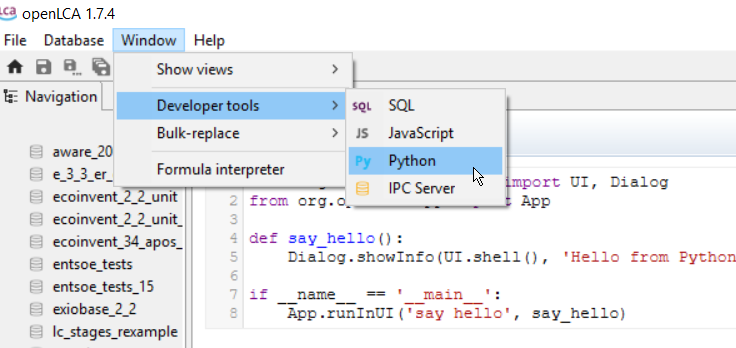
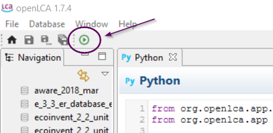
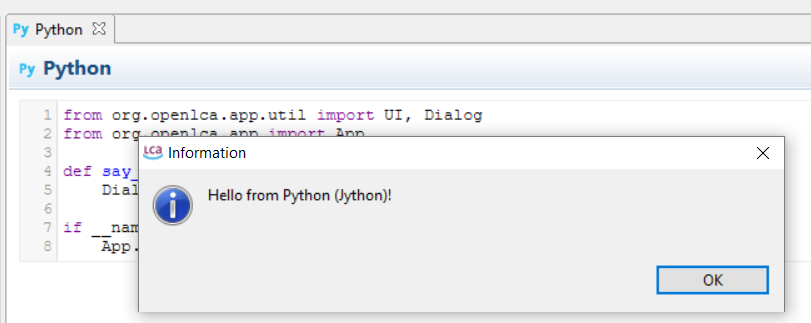

# openLCA Python Tutorial
[openLCA](https://github.com/GreenDelta/olca-app) is a Java application
and, thus, runs on the Java Virtual Machine (JVM). [Jython](http://www.jython.org/)
is a Python 2.7 implementation that runs on the JVM. It compiles Python code to
Java bytecode which is then executed on the JVM. The final release of Jython 2.7
is bundled with openLCA. Under `Window > Developer tools > Python` you can
find a small Python editor where you can write and execute Python scripts:



In order to execute a script, you click on the `Run` button in the toolbar of
the Python editor:



The script is executed in the same Java process as openLCA. Thus, you have
access to all the things that you can do with openLCA via this scripting API
(and also to everything that you can do with the Java and Jython runtime). Here
is a small example script that will show the information dialog below when you
execute it in openLCA:

```python
from org.openlca.app.util import UI, Dialog
from org.openlca.app import App

def say_hello():
    Dialog.showInfo(UI.shell(), 'Hello from Python (Jython)!')

if __name__ == '__main__':
    App.runInUI('say hello', say_hello)
```




## Content
* ...
* [Using visualization APIs](./data_viz.md)
* [The basic data model](./data_model.md)
* [Setting up a development environment](./ide_setup.md)
* [Examples](./examples.md)


## License
This project is in the worldwide public domain, released under the
[CC0 1.0 Universal Public Domain Dedication](https://creativecommons.org/publicdomain/zero/1.0/).


