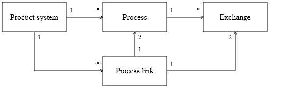

## The openLCA data model
The basic data model of openLCA is defined in the package `org.openlca.core.model`
of the [olca-core module](https://github.com/GreenDelta/olca-modules). When you
work with data in openLCA you will usually interact with the types of this
package. In this section, we describe the basic data types and how they are
related to each other. Each type is basically a Java class which you can access
like a normal Python class from Jython. However, for the description of the data
model we will use a simple notation where each type has a name and a set
of properties which again have a type:

```go
type TypeName {
    property      TypeOfProperty
    listProperty  List[TypeOfItems]
}
```

Note that we will not describe all types of the openLCA model and we will focus
on the most important properties. 


### The basic inventory model
The openLCA data model is built around a basic inventory model which has the
following components:



In this model, processes are the basic building blocks that describe the
production of a material or energy, treatment of waste, provision of a service,
etc. Each process has a set of exchanges that contain the inputs and outputs of
flows like products, wastes, resources, and emissions of that process. The
product flows (since openLCA 1.7 also waste flows) can be linked in a product
system to specify the supply chain of a product or service - the functional unit
of that product system. Such product systems are then used to calculate
inventory and impact assessment results.


### Units and unit groups
All quantitative amounts of the inputs and outputs in a process have a unit of
measurement. In openLCA convertible units are organized in groups that have
a reference unit to which the conversion factors of the units are related:

```go
type Unit {
    name              String
    conversionFactor  double
    ...
}

type UnitGroup {
    name           String
    referenceUnit  Unit
    units          List[Unit]
    ...
}
```

Units and unit groups can be created in the following way: 

```python
import org.openlca.core.model as model

kg = model.Unit()
kg.name = 'kg'
kg.conversionFactor = 1.0

unitsOfMass = model.UnitGroup()
unitsOfMass.name = 'Units of mass'
unitsOfMass.referenceUnit = kg
unitsOfMass.units.append(kg)
```

### Flows and flow properties
Flows are the things that are moved around as inputs and outputs (exchanges)
of processes. When a process produces electricity and another process consumes
electricity from the first process both processes will have an output exchange
and input exchange with a reference to the same flow. The basic type definition
of a flow looks like this:

```go
type Flow {
    name                   String
    flowType               FlowType
    referenceFlowProperty  FlowProperty
    flowPropertyFactors    List[FlowPropertyFactor]
    ...
}
``` 

#### The flow type

The `flowType` property indicates whether the flow is a product, waste, or
elementary flow. Product flows (and waste flows starting from openLCA 1.7) can
link inputs and outputs of processes (like electricity) in a product system
where elementary flows (like CO2) are the emissions and resources of the
processes. Basically, in the calculation the flow type is used to decide whether
to put an exchange amount into the technology matrix $A$ or the intervention 
matrix $B$ (see also the calculation section). 

The type `FlowType` is an enumeration type with the following
values: `PRODUCT_FLOW`, `ELEMENTARY_FLOW`, or `WASTE_FLOW`. When you create
a flow, you can set the flow type in the following way:

```python
import org.openlca.core.model as model

f = model.Flow()
f.flowType = model.FlowType.PRODUCT_FLOW
f.name = 'Liquid aluminium'
```

#### Flow properties
A flow in openLCA has physical properties (like mass or volume), called flow
properties, in which the amount of a flow in a process exchange can be specified:

```go
type FlowProperty {
    name              String
    flowPropertyType  FlowPropertyType
    unitGroup         UnitGroup
    ...
}
```

Like the `FlowType` the `FlowPropertyType` is an enumeration type and can have
the following values: `PHYSICAL` and `ECONOMIC`. The flow property type is
basically only used when physical and economic allocation factors of a process
are calculating automatically. With this, a flow property can be created in the
following way:

```python
mass = model.FlowProperty()
mass.flowPropertyType = model.FlowPropertyType.PHYSICAL
mass.unitGroup = unitsOfMass
```

For a flow, all flow properties need to be convertible by a factor which
is defined by the type `FlowPropertyFactor`:

```go
type FlowPropertyFactor {
    conversionFactor  double
    flowProperty      FlowProperty
}
```

These conversion factors are related to the reference flow property 
(`referenceFlowProperty`) of the flow: 

```python
f.referenceFlowProperty = mass
massFactor = model.FlowPropertyFactor()
massFactor.conversionFactor = 1.0
massFactor.flowProperty = mass
f.flowPropertyFactors.append(massFactor)
```

### Processes
A process describes the inputs and outputs (exchanges) related to a 
quantitative reference which is typically the output product of the process:

```go
type Process {
    name                   String
    quantitativeReference  Exchange
    exchanges              List[Exchange]
    ...
}
```

An input or output is described by the type `Exchange` in openLCA:

```go
type Exchange {
    input        boolean
    flow         Flow
    unit         Unit
    amountValue  double
    ...
}
```

The Boolean property `input` indicates whether the exchange is an input (`True`)
or not (`False`). Each exchange has a flow (like steel or CO2), unit,
and amount but also a flow property factor which indicates the physical quantity
of the amount (not that there are different physical quantities that can have
the same unit). The following example shows how we can create a process:

```python
import org.openlca.core.model as model

p = model.Process()
p.name = 'Aluminium smelting'
output = model.Exchange()  # liquid aluminium
output.input = False
output.amountValue = 1000  # kg
p.exchanges.append(output)
p.quantitativeReference = output
```
