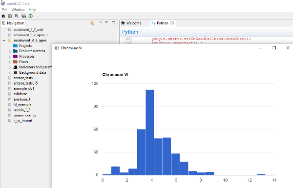

# Using Visualization APIs
The following example shows how visualization APIs can be used from the openLCA
Python API. In the example, all output amounts of
`Emission to air/unspecified/Chromium VI` are collected from a database,
transformed with `f(x) = log10(x * 1e15)` to make a nice distribution, and
shown in a histogram using the
[Google Chart API](https://developers.google.com/chart/interactive/docs/gallery/histogram).
Therefore, an HTML page is generated that is loaded in a JavaFX WebView in a
separate window.

With ecoinvent 3.3 (apos), the result looks like this:



Here is the full Python code:

```python
import json
import math

from javafx.embed.swt import FXCanvas
from org.eclipse.swt.widgets import Display, Shell
from org.eclipse.swt import SWT
from org.eclipse.swt.layout import FillLayout
from org.openlca.core.database import NativeSql, FlowDao
from org.openlca.app.util import UI


def get_flow():
    """ Get the flow `Emission to air / unspecified / Chromium VI` from the
        database.
    """
    flows = FlowDao(db).getForName('Chromium VI')
    for flow in flows:
        c = flow.category
        if c is None or c.name != 'unspecified':
            continue
        c = c.category
        if c is None or c.name != 'Emission to air':
            continue
        return flow


def get_results():
    """ Get the values for the flow from the process inputs and outputs and
        transform them: f(x) = log10(x * 1e15).
    """

    def collect_results(record):
        results.append([math.log10(record.getDouble(1) * 1e15)])
        return True

    chrom6 = get_flow()
    log.info(chrom6.name)
    results = [['Chromium VI']]
    query = 'select resulting_amount_value from tbl_exchanges where f_flow = %i' % chrom6.id
    NativeSql.on(db).query(query, collect_results)
    log.info('{} results collected', len(results))
    return results


def make_html(results):
    """ Generate the HTML page for the data. """

    html = '''<html>
    <head>
        <script type="text/javascript" src="https://www.gstatic.com/charts/loader.js"></script>
        <script type="text/javascript">
        google.charts.load("current", {packages:["corechart"]});
        google.charts.setOnLoadCallback(drawChart);
        function drawChart() {
            var data = google.visualization.arrayToDataTable(%s);
            var options = {
                title: 'Chromium VI',
                legend: { position: 'none' },
                hAxis: {
                    ticks: [0, 2, 4, 6, 8, 10, 12, 14]
                }
            };
            var chart = new google.visualization.Histogram(
                document.getElementById('chart_div'));
            chart.draw(data, options);
        }
        </script>
    </head>
    <body>
        <div id="chart_div" style="width: 900px; height: 500px;"></div>
    </body>
    </html>
    ''' % json.dumps(results)
    return html


def main():
    """ Create the results, HTML, and window with the WebView and set the HTML
        content of the WebView.
    """
    results = get_results()
    html = make_html(results)
    shell = Shell(Display.getDefault())
    shell.setText('Chromium VI')
    shell.setSize(800, 600)
    shell.setLayout(FillLayout())
    canvas = FXCanvas(shell, SWT.NONE)
    web_view = UI.createWebView(canvas)
    web_view.loadContent(html)
    shell.open()

if __name__ == '__main__':
    Display.getDefault().asyncExec(main)
```
